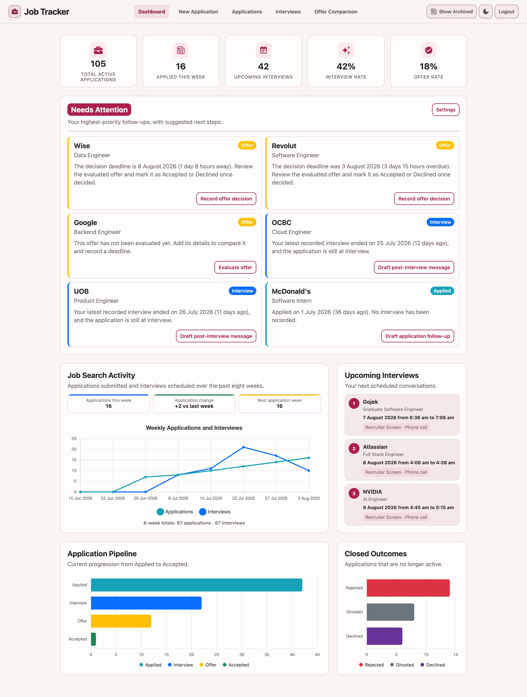

# Job Tracker

[](https://app.netlify.com/projects/jobtracker-whloh/deploys)



## Overview

Job Tracker is a full-stack PERN application for managing job applications, interviews, and structured offer comparisons. It supports status tracking, equal-weight offer scoring, archiving, CSV export, user preferences, and secure authentication.

-   Site: https://jobtracker.weihungloh.com/
-   User Guide: https://jobtracker.weihungloh.com/user-guide/
-   Explore Demo: https://jobtracker.weihungloh.com/demo/application/view

## Tech Stack

-   Frontend: React, TypeScript, Vite, Material UI
-   Backend: Node.js, Express, TypeScript
-   Database: PostgreSQL
-   Deployment: Netlify, Render, GitHub Actions, Docker

## Key Features

-   Manage job applications with status, dates, locations, posting URLs, and notes
-   Explore a fully interactive frontend demo without creating an account
-   Review application trends, pipeline stages, closed outcomes, conversion rates, and upcoming interviews
-   Prioritize up to six follow-ups using seven-day eligibility and deadline ordering, then persist sent times with Undo and demo-mode parity
-   Switch between list and Kanban board views with drag-and-drop status updates
-   Track interviews linked to job applications
-   Compare current offers using required decision timing and monthly salary, practical terms, four fit ratings, and live scores
-   Build and save one focused Counteroffer Plan by comparing the current offer with an Ideal offer, live fit changes, and competing-offer context
-   Try different priorities to see which active offer fits best and whether a small change affects the result
-   Keep saved evaluations as read-only history after status changes, or delete an active evaluation without deleting its application
-   Review or delete archived offer evaluations while keeping archived records read-only
-   Add upcoming interviews and active offer decision deadlines to Google Calendar or export them individually or in bulk as .ics files
-   Archive and restore applications and interviews
-   Export application and interview data to CSV
-   Save user display preferences
-   JWT authentication with access and refresh tokens stored in Secure, HttpOnly, SameSite cookies
-   bcrypt password hashing, rate limiting, Helmet, CORS, and user-scoped database queries

## Local development with Docker

With Docker running and `server/.env` configured with the existing Neon `PG_URI` and authentication secrets, run from the repository root:

```sh
docker compose up --build   # First build and start
docker compose up           # Later starts
docker compose down         # Stop both services
```

-   Frontend: http://localhost:5173
-   Backend: http://localhost:5005

Root Compose starts both services. Vite proxies `/api` to the backend container, which connects to hosted Neon. Source bind mounts enable Vite HMR and backend restarts through `tsx watch`; normal source edits do not require rebuilding or restarting Compose. Each container keeps its own `node_modules` volume.

After dependency or lockfile changes, refresh those dependency volumes and rebuild:

```sh
docker compose down --volumes
docker compose up --build
```

Dockerfile changes require `docker compose up --build`. After Compose or environment changes, recreate containers with `docker compose up --force-recreate`; `.env` changes do not hot reload.

For one service only, see the [frontend](client/README.md) or [backend](server/README.md) instructions. This Compose setup is for local development. Production remains Netlify, Render and Neon.
